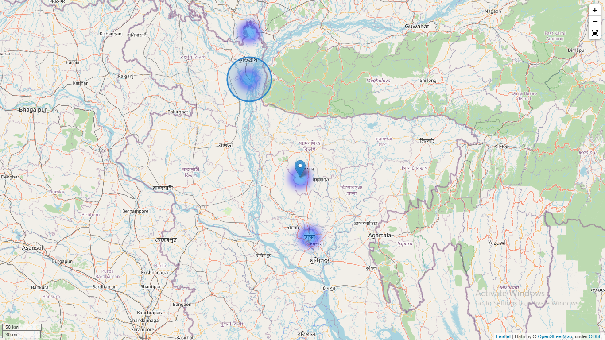
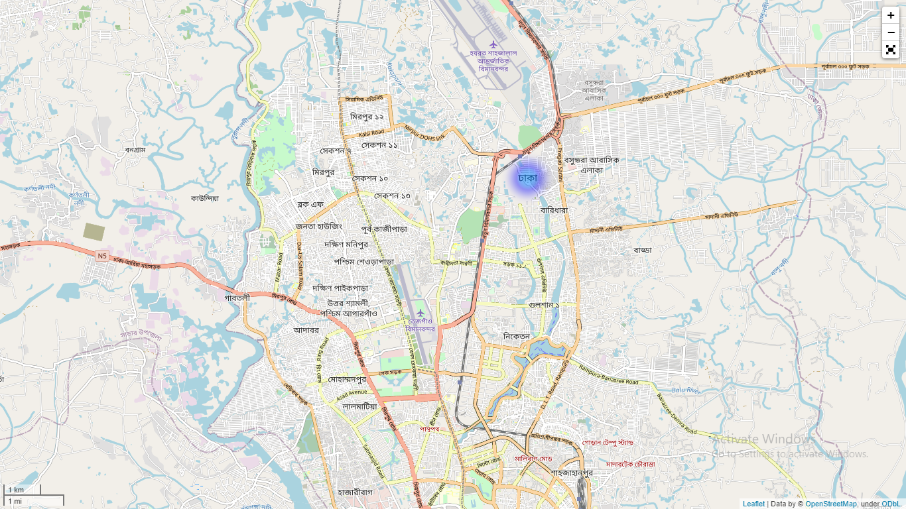
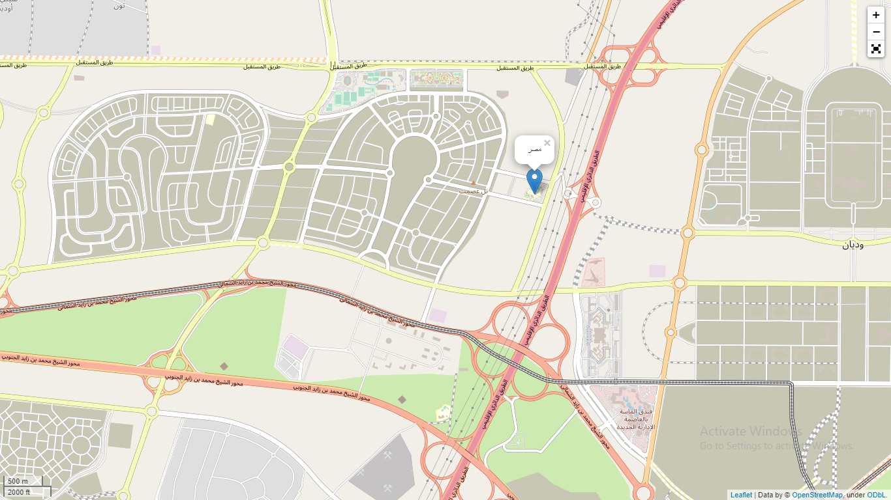

# Geocoding-Django-Folium-LeafletJS

GeoDjango intends to be a world-class geographic Web framework. Its goal is to make it as easy as possible to build GIS Web applications and harness the power of spatially enabled data. folium makes it easy to visualize data that’s been manipulated in Python on an interactive leaflet map. It enables both the binding of data to a map for choropleth visualizations as well as passing rich vector/raster/HTML visualizations as markers on the map.

The library has a number of built-in tilesets from OpenStreetMap, Mapbox, and Stamen, and supports custom tilesets with Mapbox or Cloudmade API keys. folium supports both Image, Video, GeoJSON and TopoJSON overlays. I tried various tiles here. 
By using this map you can search for any particular location/institute/field/Mosque etc and it will pin point the location. It will show all heatmap area from django default database. I fetched the data from sqlite3 for some of my personal work. I used geocoder to save the latitude and longtitude for any individual location/institute/field/Mosque etc. I have some plans with this map. In future I will try to update this map.

If you need any help then give me a knock. Thank you!

# Demo Picture

  <kbd>
 </img>
   
   </img>
   
   </img>
  </kbd>

